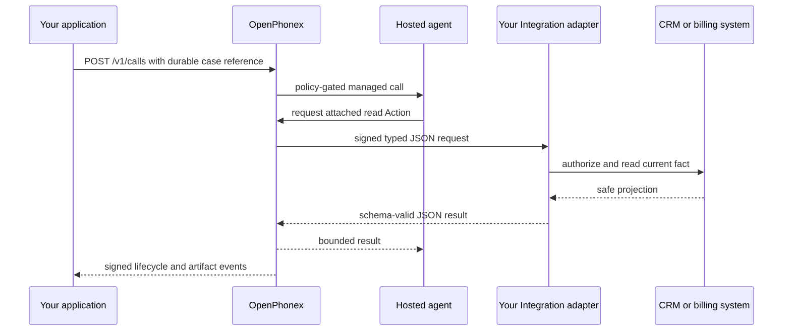

Use a customer application when your system owns the changing business record
and wants OpenPhonex to run the phone conversation. Your application selects
the case and recipient, calls the API, answers approved live-data requests
through [Integrations](/docs/integrations), and reconciles signed results.
OpenPhonex owns the governed call execution.

## Ownership boundary

| Your application owns | OpenPhonex owns |
| --- | --- |
| Recipients, cases, current balances, call cadence, retries, and final business outcomes | Policy- and wallet-gated call execution, managed agent runtime, tool allowlist, recordings/transcripts, and call results |
| CRM, calendar, billing, database, correct-person policy, and business idempotency | Phone number/media operation and OpenPhonex authorization boundaries |
| Live data through an Integration Action | Stable private reference material through a Knowledge Base |

The hosted agent is managed in OpenPhonex. Its AI model can be Gemini or another
supported model. The model decides whether to use an allowed read Action; it
does not receive your application's credentials or authority to choose arbitrary
URLs.



## Start one call

Use `POST /v1/calls`. Supply `Idempotency-Key` for retries; it is preferred over
the optional `idempotency_key` body field. The [generated API
reference](/docs/api-reference) contains the exact current schema.

```bash
curl -X POST https://api.openphonex.com/v1/calls \
  -H "Authorization: Bearer $OPENPHONEX_TOKEN" \
  -H "Content-Type: application/json" \
  -H "Idempotency-Key: reminder-case-456-attempt-1" \
  -d '{
    "organization_id": "org_123",
    "project_id": "proj_123",
    "from_phone_number_id": "num_123",
    "to_phone_number": "+1 555 0100",
    "country": "US",
    "purpose": "payment_reminder",
    "agent_id": "agent_123",
    "user_authorization": {
      "authorized_by": "ops-user-123",
      "reason": "customer-approved payment reminder"
    },
    "external_reference": "case_456",
    "external_group_reference": "reminder_batch_2026_08",
    "call_context": { "locale": "en-US" }
  }'
```

`external_reference` is your stable case ID; OpenPhonex stores it but does not
interpret it. `external_group_reference` can identify your batch. Keep
`call_context` small and non-secret—at most 32 JSON properties—and use it only
for facts valid when the call begins. It is not a place for case history,
credentials, or authorization tokens. A conversation workflow's read tool is the
one thing served from it: send the fields that tool projects under
`call_context.case_snapshot`. See [Agent workflows](/docs/agent-workflows).

For a hosted agent with published language profiles, select one with
`runtime_config.language` in the call request. A `locale` or
`preferred_language` property inside `call_context` is only metadata and does
not select a profile. Your application still owns row overrides and batch
language choices. See [Multilingual outbound
calls](/docs/multilingual-outbound) for configuration and admission behavior.

### Retry, backpressure, and cancel boundaries

- Repeating the same canonical request with the same idempotency key returns the
  original call. Reusing a key for a different request returns `409`.
- A full bounded outbound queue returns `429` with `Retry-After` and
  `retry_after_seconds`. Respect that delay and keep your own queue bounded.
- `POST /v1/calls/{call_id}/cancel` can cancel only a queued call whose
  originate job has not been claimed. It releases the corresponding wallet
  reservation. Once a worker has claimed the job, the API returns `409` rather
  than pretending a carrier call was stopped.

Read current progress with `GET /v1/calls`, and fetch recording, transcript,
waveform, and artifact evidence through the call endpoints in the generated
reference. Use [signed events](/docs/post-call-results) for prompt,
authoritative reconciliation rather than assuming an HTTP create response means
the call completed.

## Live facts come from typed Actions

Attach only the read Actions that this agent needs. At call time the model can
supply only that Action's declared business arguments. OpenPhonex injects the
canonical organization, project, call, agent, external references, and call
context; it signs the request to your adapter. Your adapter verifies the
signature, checks its own business authorization, dispatches `tool.name`, and
returns a bounded response matching the Action's output schema.

This is deliberately different from a Knowledge Base:

| Use | Put it here |
| --- | --- |
| Opening hours, product terms, policy wording, and durable FAQ text | Knowledge Base |
| Current account balance, booking availability, order status, or CRM record | Integration Action |
| A conversation decision or generated wording | The managed model, within the agent's instructions and allowed tools |

## Payment reminder example

A payment reminder is a useful boundary test because the business facts change
and the conversation is sensitive.

1. Your application selects a permitted case and recipient under its own
   cadence, suppression, dispute, time-window, and retry rules. It creates a
   bounded call with an `external_reference` such as `case_456`.
2. OpenPhonex independently authorizes the requested call under its policy,
   wallet, and organization controls, then runs the configured managed agent.
3. Stable explanation of your payment policy can live in a Knowledge Base.
   Account status and payment link must be requested through a narrow read
   Action, never copied into the prompt. The figures a conversation workflow is
   allowed to disclose travel as that call's own
   `call_context.case_snapshot`, bounded by the tool's declared projection.
4. Before your application has established the correct person, its adapter
   returns a safe projection with no balance, debt, or account history. The
   hosted agent must not disclose those facts merely because the caller supplied
   an identifier.
5. Your application receives signed terminal and artifact-ready events, reads
   the evidence it needs, and determines its own next business step. Advisory
   extraction can assist triage but cannot be the accounting or policy record.

OpenPhonex does not replace your CRM, debt/case system, consent process, or
correct-person verification. It provides the governed telephony and managed
agent layer around the call.

## Build for reconciliation

Persist your own case ID, the returned OpenPhonex call ID, idempotency key, and
the final event ID. Deduplicate signed events by their event `id`; deliveries
are retryable. Treat terminal lifecycle events and call evidence as authoritative
for the OpenPhonex outcome. Treat your own case state as authoritative for your
business outcome.

For a compact, schema-validated summary after a completed call, configure
[post-call extraction](/docs/post-call-results). It is optional and advisory;
it never changes the call, policy, wallet, or customer systems.
